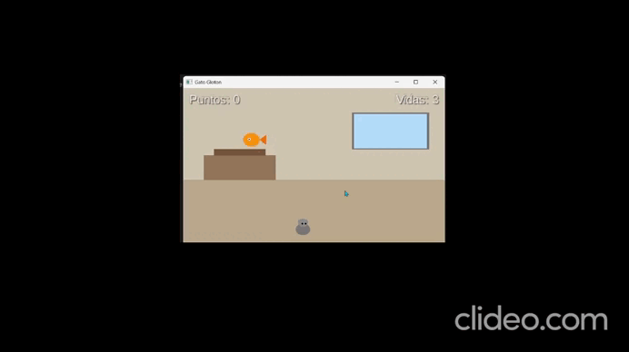

# JuegoProyecto
#  CatDrop - Proyecto Videojuego con libGDX

##  Introducción

**CatDrop** es un videojuego desarrollado con **Java y libGDX**, inspirado en el ejemplo base *Drop* pero con una temática diferente.

En el juego controlamos a **un gato** que debe recoger los objetos que caen desde la parte superior de la pantalla.  
El objetivo es **recoger la mayor cantidad de objetos posible para aumentar la puntuación**, evitando perderlos.

El juego cuenta con varias pantallas:

- **Menú principal** donde se muestran las instrucciones para jugar.
- **Pantalla de juego** donde se desarrolla la partida.
- **Pantalla de Game Over** que aparece cuando el jugador pierde.

El proyecto ha sido desarrollado en **Android Studio** utilizando **libGDX** y funciona en **Desktop (LWJGL3)**.

---

##  Desarrollo

###  Lógica del juego

El juego utiliza el ciclo principal de libGDX:

`Input → Update (deltaTime) → Render`

Las principales mecánicas del juego son:

- **Movimiento del jugador**  
  El jugador controla al gato utilizando el teclado para moverse por la pantalla.

- **Generación aleatoria de objetos**  
  Los objetos aparecen de forma aleatoria en la parte superior de la pantalla y caen hacia abajo.

- **Sistema de colisiones**  
  Se utilizan **rectángulos (AABB)** para detectar cuando el gato recoge un objeto.

- **Sistema de puntuación**  
  Cada objeto recogido aumenta la puntuación del jugador, la cual se muestra en pantalla.

- **Delta Time**  
  Se utiliza `deltaTime` para que el movimiento sea independiente del rendimiento del hardware.

---

###  Estructura del juego

El juego está organizado utilizando la arquitectura de **Game y Screen de libGDX**.

Principales pantallas y clases:

- **MainGame**  
  Clase principal que inicia el juego.

- **MenuScreen**  
  Pantalla inicial donde se muestran las instrucciones y se puede comenzar la partida.

- **GameScreen**  
  Pantalla donde ocurre el gameplay y se desarrolla la lógica principal del juego.

- **GameOverScreen**  
  Pantalla que aparece cuando el jugador pierde la partida y permite reiniciar el juego.

También se gestionan recursos como:

- **Texture** para los gráficos
- **Sound** para efectos de sonido
- **Music** para música de fondo

---

##  Conclusiones

Durante el desarrollo de este proyecto se han aprendido varios conceptos importantes del desarrollo de videojuegos con **libGDX**.

Se ha trabajado con el **ciclo de vida de un videojuego**, la gestión de **pantallas**, la detección de **colisiones** y el uso de **delta time** para que el movimiento sea consistente en diferentes dispositivos.

Además, se ha comprendido la diferencia entre la **lógica del juego** (posiciones, colisiones, puntuación) y su **representación gráfica** mediante sprites y texturas.

Este proyecto ha permitido crear un videojuego funcional a partir del ejemplo base *Drop*, ampliándolo con nuevas pantallas y mecánicas.

---

 Demo del juego

  

A [libGDX](https://libgdx.com/) project generated with [gdx-liftoff](https://github.com/libgdx/gdx-liftoff).

This project was generated with a template including simple application launchers and an empty `ApplicationListener` implementation.

## Platforms

- `core`: Main module with the application logic shared by all platforms.
- `lwjgl3`: Primary desktop platform using LWJGL3; was called 'desktop' in older docs.
- `android`: Android mobile platform. Needs Android SDK.

## Gradle

This project uses [Gradle](https://gradle.org/) to manage dependencies.
The Gradle wrapper was included, so you can run Gradle tasks using `gradlew.bat` or `./gradlew` commands.
Useful Gradle tasks and flags:

- `--continue`: when using this flag, errors will not stop the tasks from running.
- `--daemon`: thanks to this flag, Gradle daemon will be used to run chosen tasks.
- `--offline`: when using this flag, cached dependency archives will be used.
- `--refresh-dependencies`: this flag forces validation of all dependencies. Useful for snapshot versions.
- `android:lint`: performs Android project validation.
- `build`: builds sources and archives of every project.
- `cleanEclipse`: removes Eclipse project data.
- `cleanIdea`: removes IntelliJ project data.
- `clean`: removes `build` folders, which store compiled classes and built archives.
- `eclipse`: generates Eclipse project data.
- `idea`: generates IntelliJ project data.
- `lwjgl3:jar`: builds application's runnable jar, which can be found at `lwjgl3/build/libs`.
- `lwjgl3:run`: starts the application.
- `test`: runs unit tests (if any).

Note that most tasks that are not specific to a single project can be run with `name:` prefix, where the `name` should be replaced with the ID of a specific project.
For example, `core:clean` removes `build` folder only from the `core` project.
